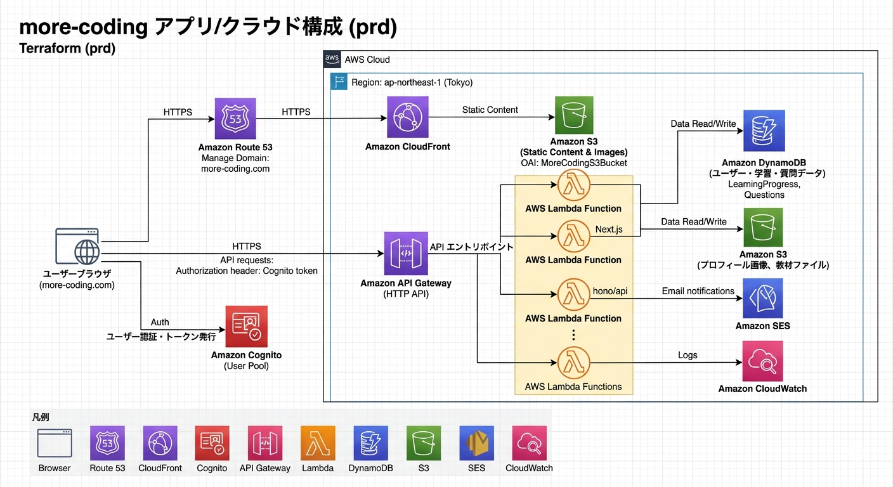

# 事業構成要素
## サイトdomain
https://more-coding.com/

## GitHub
https://github.com/NaokiMM/more-coding

# 開発構成要素
## Stgブランチ
AWS AmpligyでStgブランチを本番同様、デプロイしています。 
また、Stgブランチは認証機能付きであるためUsername/Passwordが必要です。
## 環境変数の扱い
設定値（URL など）はコードに直接書かず、環境変数として管理する。
### .env.local
.env.local：環境ごとの値を定義する場所
### process.env
process.env：コードから環境変数を取得するための入口

### 連携
.env.local の値は Next.js 起動時に読み込まれ、process.env 経由で利用される。
これにより、同じコードをローカル・本番で使い回せる。

## Hono（バックエンド）
more-coding 向けの HTTP バックエンド（Hono）を置いている。Next と役割分担し、長めの処理や将来のコード実行などをここに寄せる想定。

- **api**（`hono/api`）— `GET /health`、`POST /run`（実行はスタブ）
  - 起動: `cd hono/api && npm install && npm run dev`（http://localhost:4000）

詳細は `hono/README.md` および `hono/api/README.md` を参照。

## Redash（ローカル Docker）
[Redash](https://redash.io/) はクエリ可視化・ダッシュボード用の OSS です。本リポジトリの `docker-compose.yml` では、**ローカル開発用**に Redash とその内部依存（PostgreSQL・Redis）を定義しています。既存の **DynamoDB Local**（ポート 8000）と同じ Compose ファイルでまとめて起動できます。

### Compose で定義されているサービス（要点）
| サービス | 役割 | ホスト側ポート（例） |
|---------|------|---------------------|
| `dynamodb` | DynamoDB Local（従来どおり） | 8000 |
| `postgres` | Redash のメタデータ用 DB | 5432（デバッグ用に公開） |
| `redis` | クエリジョブのキュー | 6379（デバッグ用に公開） |
| `server` | Redash 本体（Web） | **5001** → コンテナ内 5000 |

ホストの **5000** が他プロセス（macOS の AirPlay レシーバー等）と競合しやすいため、Redash への接続は **`http://localhost:5001`** としています。

### 初回セットアップ（DB マイグレーション）
1. **`REDASH_COOKIE_SECRET` を必ず設定する**  
   未設定のまま `create_db` を実行すると、Redash が起動時に例外で終了します。ローカル用のランダム値を生成して `docker-compose.yml` の `server` サービス環境変数 `REDASH_COOKIE_SECRET` に設定してください。

   ```bash
   openssl rand -hex 32
   ```

2. **PostgreSQL / Redis を起動したうえでスキーマ作成**

   ```bash
   docker compose run --rm server create_db
   ```

### 起動・停止
リポジトリルートで実行します。

```bash
# バックグラウンド起動（DynamoDB Local・Postgres・Redis・Redash すべて）
docker compose up -d

# 停止・削除（コンテナのみ。名前付きボリュームを使っていないため DB データはコンテナ削除で失われる点に注意）
docker compose down
```

ブラウザで **`http://localhost:5001`** を開き、表示された画面に従って管理者アカウントを作成してください（初回アクセス時）。

### 注意（Apple Silicon など）
Redash 公式イメージは **linux/amd64** の場合があり、`docker compose up` 時にプラットフォーム不一致の警告が出ることがあります。通常はエミュレーションで動作しますが、初回起動はイメージ取得で時間がかかることがあります。

### 本番・共有環境について
`REDASH_COOKIE_SECRET` はセッション署名に使う秘密情報です。**本番や複数人で共有する環境では、リポジトリに固定値をコミットせず**、`.env` やシークレット管理に寄せる運用を推奨します（`.env` は Git に含めない）。

## システム構成図（prd）
Terraform `terraform/envs/prd` と Next.js/（Hono/Lambda）連携の全体像です。



# Secretsファイルリスト
※チーム内メンバーより提供必要有り。
・.env.local

# 主なコーディング手法と理由
### 手法
Top-Down Readability（トップダウン設計）

### 理由
ファイルを開いた時点で「何をするコードか」を即座に把握できたり、実装詳細や補助処理を後回しにでき、読み進めやすいため。

## GitHub への適用ルール

### コミット・プッシュルール
1 push = 1 機能追加 を原則とし、各内容は「何をしたのか」を第三者に説明できる、理解しやすい形にまとめる。

### マージルール

すべての変更は以下の手順で反映してください。
#### 1. 作業用ブランチを作成
#### 2. 変更をコミット・push
#### 3. Pull Request を作成
#### 4. 最低1件のレビュー承認後にマージ

※承認なしでは main にマージできません。

### GitHubブランチ設定方法
#### Repositry > Settings > Branches > Branch protection rule内でブランチルールを設定
#### PR必須: Require a pull request before merging > Require approvals（1）
#### 管理者もPR必須: Do not allow bypassing the above settings

## AWSクラウドの主な使用サービス
##### DB: DynamoDB
##### 認証: Cognito
##### メール配信：Amazon SES
##### サーバー: Lambda・Amplify（環境変数含む）
##### API: API Gateway
##### オブジェクトストレージ: S3
##### CDN: CloudFront
##### ドメイン管理: Route53
##### アカウン制御: IAM
##### コンテナサービス: Docker
##### 監視・ログ：CloudWatch
##### IAC:Terraform

## Google Postmaster Tools
more-coding.com から Amazon SES で送るメールについて、Gmail 側の指標を把握するため [Google Postmaster Tools](https://postmaster.google.com/) の利用を開始している。

### 目的
到達率・ドメイン/送信元のレピュテーションなどを把握し、SPF/DKIM/DMARC や送信運用の改善に役立てる。

### 運用メモ（最低限）
・Postmaster Tools でドメイン（more-coding.com）を登録し、案内に従って DNS を確認する  
・SES の送信設定と整合するよう、認証レコードや From ドメインを維持する  

## Well-Architected Tool
### 目的
AWS Well-Architected Tool（WAT）で、運用/セキュリティ/コスト等の観点を定期的に点検して改善点を管理する。

### 運用メモ（最低限）
・AWSコンソール → Well-Architected Tool で Workload を作成/選択する  
・定期的に Review を実施し、結果（重要な指摘・対応方針）を残す  
・必要に応じて Lens（例: Serverless）を追加して再評価する  

## テスト方針
### 単体テスト
ロジック単位の検証は自動テストで実施する。

### 結合テスト
API と DB、フロントエンドと API の連携部分を検証する。

### システムテスト（E2E）
システム全体の動作確認は
Playwright を使用して自動化する。
ブラウザ操作（画面遷移・フォーム入力・API応答確認など）を自動実行し、本番に近い環境での動作保証を行う。
重要なユーザーフロー（認証、サブスクリプション処理など）を中心に自動化し、UXや最終確認は必要に応じて手動テストを併用する。

## AI面接
https://aistudio.google.com　にて、Gemini APIを使用する。

## 請求サービス
Stripeを使用している。

### 必要なコマンド
#### ログイン確認
stripe login

#### ログイン確認
stripe config --list

## Contribution / コントリビューション
本リポジトリは OSSに近い運用 をしています。

## 共同開発者
リポジトリオーナーが Write 権限 を付与します。作業はブランチ作成 → PR。main への直接 push は不可。すべての PR は オーナーのレビュー・承認後にマージされます。

## 外部コントリビューター
Fork → 変更 → Pull Request を作成してください。
